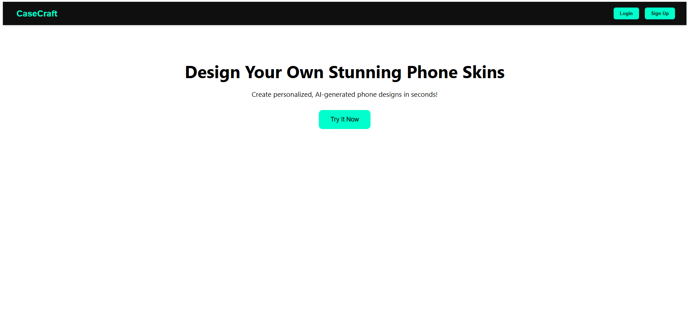
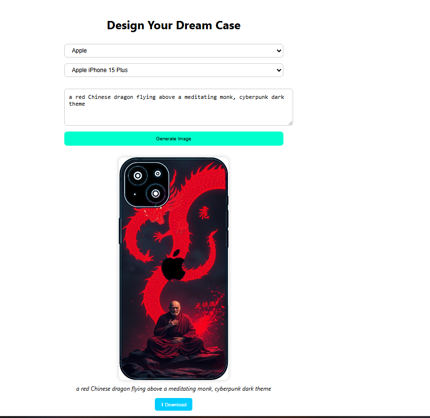
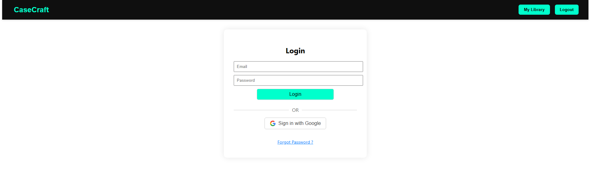

# CaseCraft Backend

CaseCraft is a backend service for generating custom phone skins and
wallpapers using generative AI.\
The project powers [CaseCraft.space](https://www.casecraft.space/) and
is built with **FastAPI**, **PostgreSQL**, **Redis**, and **Docker
Compose**.\
It integrates with **Replicate** for image generation and supports both
standard authentication and Google OAuth.


## ✨ Live Demo

👉 <https://www.casecraft.space/>

## 📌 Problem Statement

- Current platforms only provide **fixed templates** or **static designs** for phone skins.  
- Users lack **personalized, creative, and AI-driven customization options**.  
- CaseCraft solves this by offering **100% custom AI-generated designs**, aligned to real phone dimensions. 


## 🚀 Features

-   **User Authentication**
    -   Email-based signup/login with secure password hashing.
    -   Google OAuth2 login support.
    -   Forgot password & reset password flow.
-   **Image Generation**
    -   AI-powered phone skin and wallpaper generation using
        **Replicate**.
    -   Mask-based image customization for phone models.
    -   Previews and multiple generations for user choice.
-   **Phone Models**
    -   Current support: only a subset of phone models (masks created).
    -   Future plan: add masks and support for more devices.
    -   Data & images scraped from
        [Dimensions.com](https://www.dimensions.com/collection/phones-cell-phones).
-   **Storage & Database**
    -   PostgreSQL for structured user + image data.
    -   Redis for caching & async task management.
    -   Cloudinary for storing generated images.
-   **Deployment**
    -   Docker Compose setup for reproducible deployments.
    -   Deployed on **AWS EC2** with Nginx reverse proxy.
    -   CI/CD planned for automated deployments.

## 🔄 Flow of Operations

1. User selects **phone brand** → **phone model**.  
2. User enters a **prompt** and clicks **Submit**.  
3. Backend calls **Replicate API** with the selected phone’s **aspect ratio** to generate the image.  
4. Once generated:  
   - The backend **applies the phone mask** (phone outline overlay) → preview image shown to user.  
   - In the background, the backend requests **upscaling** via Real-ESRGAN → stores result in **S3**.  
5. If the user clicks **Download**:  
   - If upscaling is finished → fetch from **S3** and return.  
   - If still processing → Redis tracks state, user is asked to **wait**.  
6. Phone masks are stored in **S3** and fetched by backend at generation time.  


## 🛠️ Tech Stack

-   **Backend Framework:** FastAPI
-   **Database:** PostgreSQL
-   **Cache/Queue:** Redis
-   **Image Generation:** Replicate API
-   **Authentication:** Custom auth + Google OAuth2
-   **Deployment:** Docker Compose on AWS EC2
-   **Storage:** AWS S3

## 📂 Project Structure
 
    casecraft-backend/
    ├── app/
    │   ├── db.py
    │   ├── main.py
    │   ├── models.py
    │   ├── schemas.py
    │   ├── __init__.py
    │   └── routers/
    │       ├── generate.py
    │       ├── phones.py
    │       ├── users.py
    │       └── __init__.py
    │
    ├── migrations/
    │   ├── env.py
    │   ├── README
    │   ├── script.py.mako
    │   └── versions/          # Database migration files (auto-generated by Alembic)
    │
    ├── scripts/
    │   ├── auth.py
    │   ├── dimensions_web_scrapper.py
    │   ├── seed_phone_brands_models.py
    │   ├── upload_masks_to_s3.py
    │   ├── utils.py
    │   └── __init__.py
    │
    ├── templates/
    │   └── reset_password_mail.html
    │
    ├── screenshots/           # Used in README.md
    │   ├── homepage.png
    │   ├── login_page.png
    │   ├── signup_page.png
    │   ├── gen_example_1.png
    │   └── downloaded_example_1.png
    │
    ├── alembic.ini
    ├── docker-compose.yaml
    ├── Dockerfile
    ├── requirements.txt
    └── README.md


## 📦 Installation & Setup

1.  Clone the repo:

    ``` bash
    git clone https://github.com/robokage/case_craft_backend.git
    cd case_craft_backend
    ```

2.  Create a `.env` file:

    ``` env
    DATABASE_URL=postgresql://user:password@db:5432/casecraft
    REDIS_SERVER=localhost
    REDIS_PORT=6379
    REPLICATE_API_TOKEN=your_replicate_token
    AWS_ACCESS_KEY_ID=your_access_key_id
    AWS_SECRET_ACCESS_KEY=your_secret_access_key
    AWS_REGION=aws-region
    AWS_S3_BUCKET=your-bucket-name
    SECRET_KEY=your_secret_key
    JWT_ALGORITHM=your_jwt_algorithm
    ACCESS_TOKEN_EXPIRE_MINUTES=15
    GOOGLE_CLIENT_ID=your_google_client_id
    GOOGLE_CLIENT_SECRET=your_google_client_secret
    GOOGLE_REDIRECT_URI=https://localhost:8000/user/google/callback
    ```

3.  Start with Docker Compose:

    ``` bash
    docker-compose up --build
    ```

4.  Run database migrations:

    ``` bash
    alembic upgrade head
    ```

5.  Access API at: `http://localhost:8000`


## 🔐 Authentication Flow

-   **Email Signup/Login**
-   **Forgot Password → Reset Link**
-   **JWT-based sessions**
-   **Google OAuth2 login**


## 📈 Roadmap / To Do

- [ ] **CI/CD**: Add CI/CD pipeline for automated deployments
- [ ] **Phone Models**: Create mask and add support for more phone models
- [ ] **Theme Packs**: Anime, sports, artistic, etc. → train small **LoRA models** (10–30 images per theme). 
- [ ] **User Library**: Signed-in users can view images generated in the last 48 hours.   
- [ ] **Digital Marketplace**: Community-driven platform for **sharing & monetizing designs**.  
- [ ] **Image Editing**: Allow editing of generated or user-uploaded images via prompts (Flux Kontext / Nano Banana).  
- [ ] **Prompt Enhancements**: Make prompts better understood for **phone-skin generation context**. 
- [ ] **Background Jobs**: Scheduled cleanup (e.g., Celery) → delete images from S3 after 48 hours.  


## 📸 Screenshots

### Homepage



### Image Generation



### Signup


### Login


